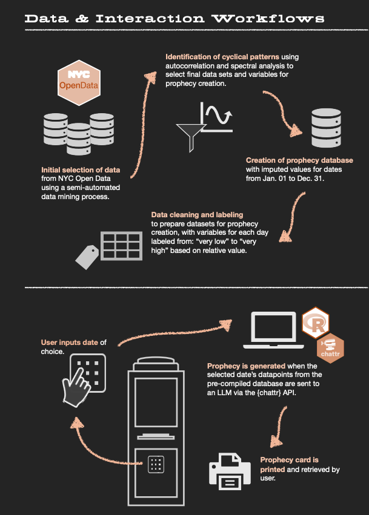

# NYC Oracle

An interactive art + data project that turns cyclical signals in NYC Open Data into short prophecies. Participants specify a month and day and a prediction is generated based on historical patterns for that date.

Prophecies are produced by mining NYC Open Data for recurring, seasonal, and cyclical patterns (e.g., noise complaints, tree blooms, MTA ridership, rat sightings, energy use). Selected data points for the requested date are processed and sent to a large language model via the {ellmer} API (called from R) which translates rhythms and signals into short, poetic predictions.

## Quick start

### Prerequisites
- R >= 4.5.2
- LLM / API credentials stored in `~/.Renviron` or a project `.Renviron`

### Setup
1. Open the project with RStudio via `nyc-oracle.Rproj`.
2. Add environment variables to `~/.Renviron` or project `.Renviron`:
   - CHATTR_API_KEY=your_key_here
3. Install dependencies 

### Run Scripts

- Generate an example prophecy (local test) using `scripts/example-prophecy-pipeline.R`

## Key files

`scripts` has all scripts including `utils` which contain core helpers (data pulls, quantile categorization, seasonality scoring, prompt construction) used by the top-level scripts. 

- `scripts`:
    - `example-prophecy-pipeline.R` - Runs an example of the prototype pipeline. Assembles data for a requested month/day, builds LLM prompts, calls the chattr/LLM API, and formats the prophecy text used by the animation and printed card.

- `scripts/utils`:
    - `analyze-and-process-cycles.R` - Utilities to compute counts by date, build full daily series, and produce seasonality/ACF scores.

    - `categorize-values-by-date.R` - Quantile-based categorization helpers (e.g., `categorize_by_distribution`) used to turn numeric counts into ordered labels: very low, low, medium, high, very high.

    - `generate-prophecy.R` - Helper functions for assembling the final data text that is sent to the LLM (prompt templates, token-safe formatting).

    - `get-datasets-and-metadata.R` - Metadata lookup and dataset discovery helpers for browsing and selecting candidate NYC datasets.

## Overview Diagram

  

## Contact

- For questions or contributions, please open an issue in the repository.